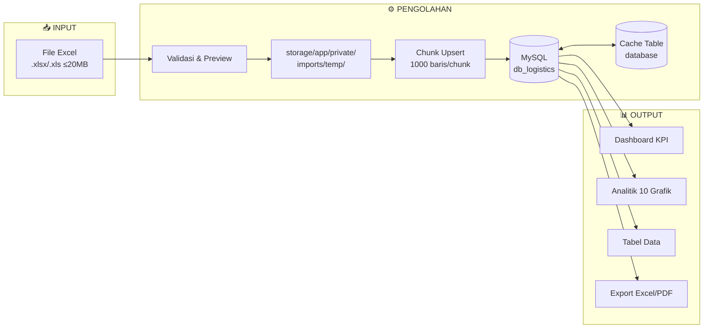
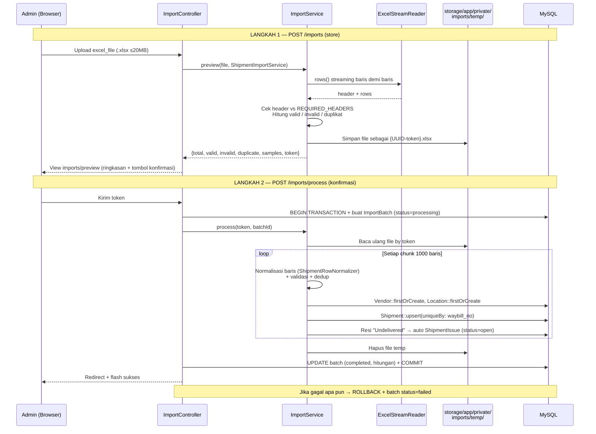
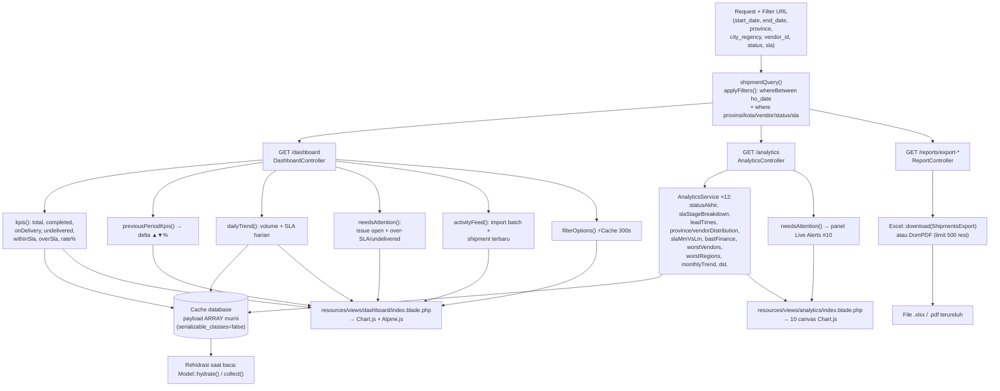
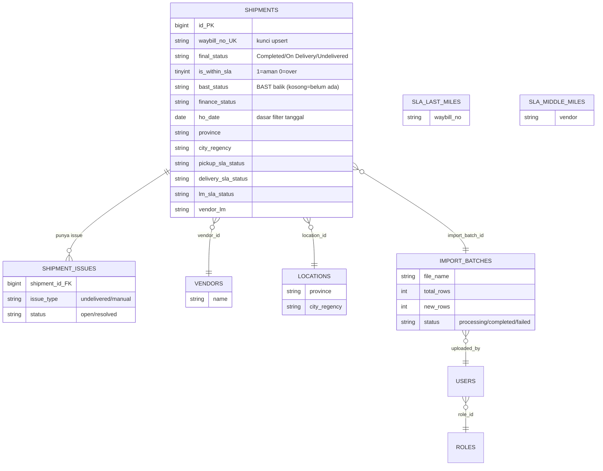

# 📦 Arsitektur Sistem — DB Logistics Dashboard

> Dokumentasi cara kerja sistem: alur data dari input (Excel) → pengolahan → output (dashboard, analitik, export).
> Terakhir diperbarui: 21 Agustus 2026.

---

## 1. Arsitektur Besar (3 Lapis)

```
INPUT (Excel) ──► OLAH (Service + MySQL + Cache) ──► OUTPUT (Dashboard/Analitik/Export)
```



---

## 2. Struktur Folder & File Lengkap

```
db-logistics-dashboard/
│
├── routes/
│   └── web.php                      # 🗺️ Peta URL → Controller (semua endpoint terdaftar di sini)
│
├── app/
│   ├── Http/Controllers/            # 🚪 LAPISAN 1: Entry point HTTP
│   │   ├── ImportController.php     #    POST upload → preview → proses batch → clear data
│   │   ├── DashboardController.php  #    GET /dashboard (KPI, delta, tren, alerts, feed)
│   │   ├── AnalyticsController.php  #    GET /analytics (12 dataset grafik 01–10)
│   │   ├── ShipmentController.php   #    GET /shipments (tabel + detail resi)
│   │   ├── IssueController.php      #    POST resolve/reopen issue
│   │   ├── ReportController.php     #    GET /reports + export Excel & PDF
│   │   ├── UserController.php       #    CRUD user (admin)
│   │   └── ProfileController.php    #    Profil akun
│   │
│   ├── Services/                    # 🧠 LAPISAN 2: Logika bisnis (otak sistem)
│   │   ├── ImportService.php        #    Mesin generik: preview() + process() semua jenis import
│   │   ├── ShipmentImportService.php     # Konfigurasi import pengiriman (normalizer+sheet)
│   │   ├── SlaLastMileImportService.php  # Konfigurasi import SLA last mile
│   │   ├── SlaMiddleMileImportService.php# Konfigurasi import SLA middle mile
│   │   ├── SlaAllImportService.php       # Konfigurasi import SLA all
│   │   ├── InboundFirstMileImportService.php # Konfigurasi import inbound FM
│   │   ├── IssueImportService.php        # Konfigurasi import issue manual
│   │   ├── DashboardService.php     #    shipmentQuery, applyFilters, kpis, dailyTrend,
│   │   │                            #    needsAttention, activityFeed, filterOptions, openIssueCount
│   │   └── AnalyticsService.php     #    12 agregasi: statusAkhir, province/vendorDistribution,
│   │                                #    slaMmVsLm, bastFinance, worstVendors/Regions, leadTimes, dst.
│   │
│   ├── Imports/                     # 🔧 Kelas upsert Maatwebsite Excel (per chunk)
│   │   ├── ShipmentImport.php       #    uniqueBy waybill_no → Shipment::upsert + auto-create issue
│   │   ├── SlaLastMileImport.php / SlaMiddleMileImport.php / SlaAllImport.php
│   │   ├── InboundFirstMileImport.php / IssueImport.php
│   │
│   ├── Support/                     # 🛠️ Utilitas pemrosesan baris
│   │   ├── ExcelStreamReader.php    #    Baca Excel streaming (hemat memori, cari sheet otomatis)
│   │   ├── ShipmentRowNormalizer.php    # Petakan header Excel acak → kolom DB standar
│   │   ├── StatusNormalizer.php     #    Standarisasi nilai status ("completed"→"Completed", dll.)
│   │   └── ...5 normalizer lainnya per jenis import
│   │
│   ├── Models/                      # 🗄️ ORM Eloquent (1 class = 1 tabel)
│   │   ├── Shipment.php             #    Tabel utama (33rb+ resi)
│   │   ├── Vendor.php / Location.php    # Master vendor & wilayah (auto firstOrCreate saat import)
│   │   ├── ImportBatch.php          #    Riwayat upload (status processing/completed/failed)
│   │   ├── ShipmentIssue.php        #    Issue otomatis dari resi Undelivered + manual
│   │   ├── SlaLastMile.php / SlaMiddleMile.php / SlaAll.php / InboundFirstMile.php
│   │   └── User.php / Role.php
│   │
│   └── Exports/
│       └── ShipmentsExport.php      #    Generator export Excel laporan
│
├── database/migrations/             # 📐 Skema tabel MySQL
├── resources/views/                 # 🎨 LAPISAN 3: Tampilan Blade
│   ├── layouts/ (app, guest, navigation)  # Kerangka + sidebar + dark mode
│   ├── dashboard/index.blade.php    #    4 KPI card + stacked bar + 1 chart dual-axis + 2 panel
│   ├── analytics/index.blade.php    #    Grafik 01–10 + JS Chart.js inline
│   ├── shipments/, issues/, imports/, reports/, users/, auth/
│   └── components/status-badge.blade.php # Badge Emerald/Amber/Rose
├── resources/js/app.js              # Alpine.js directives + tema Chart.js sadar dark mode
├── resources/css/app.css            # Komponen CSS (.card, .btn-primary, dark variants)
├── public/images/logo-anl.png       # Logo perusahaan
├── storage/app/private/imports/temp/# 📁 File Excel sementara antara langkah 1→2
└── config/cache.php                 # ⚠️ serializable_classes=false (cache wajib array murni)
```

---

## 3. Alur Import Data (Input)

Dua langkah dengan token UUID sebagai jembatan:



**Poin penting**: `Shipment::upsert` dengan kunci unik `waybill_no` membuat import **idempotent** — upload ulang file yang sama tidak menduplikasi data, hanya memperbarui.

---

## 4. Alur Olah Data → Output

Semua halaman membaca lewat **satu query dasar yang sama** (`DashboardService::shipmentQuery`) sehingga filter global konsisten:



### Grafik di Halaman `/analytics` (01–10)

| # | Grafik | Sumber Method |
|---|---|---|
| 01 | Status Pengiriman | `AnalyticsService::statusAkhirDistribution()` |
| 02 | SLA Compliance Rate | `DashboardService::kpis()` (withinSla/overSla) |
| 03 | SLA Middle Mile vs Last Mile | `AnalyticsService::slaMmVsLmComparison()` |
| 04 | Top 5 Alokasi Provinsi | `AnalyticsService::provinceDistribution()` |
| 05 | Top Vendor Load | `AnalyticsService::vendorDistribution()` |
| 06 | Status BAST Balik | kolom `shipments.bast_status` via `bastFinanceBreakdown()` |
| 07 | BAST Handover Finance | `AnalyticsService::bastFinanceBreakdown()` |
| 08 | SLA Funnel & Average Lead Time | `slaStageBreakdown()` + `leadTimes()` |
| 09 | Bottleneck: Worst SLA & Pending Region | `worstVendors()` + `worstRegions()` |
| 10 | Live Alerts & Open Issues | `DashboardService::needsAttention()` |

---

## 5. Skema Database



---

## 6. Aturan Cache (Kritis!)

| Hal | Nilai |
|---|---|
| Driver | `CACHE_STORE=database` (tabel `cache`) |
| Pembatasan | `config/cache.php` → `'serializable_classes' => false` |
| Konsekuensi | Objek PHP yang di-cache menjadi rusak (`__PHP_Incomplete_Class`) |
| **Aturan emas** | Hanya cache **array/scalar murni**; model di-rehydrate dengan `Model::hydrate()` / `collect()` setelah dibaca |

---

## 7. Ringkasan Endpoint

| Method | URL | Controller | Role | Output |
|---|---|---|---|---|
| GET | `/dashboard` | DashboardController | semua auth | KPI + 1 chart + alerts + feed |
| GET | `/analytics` | AnalyticsController | admin, PM | 10 grafik bernomor |
| GET | `/shipments`, `/shipments/{id}` | ShipmentController | semua auth | tabel + detail resi |
| GET/POST | `/issues`, `/issues/{id}/resolve\|reopen` | IssueController | semua auth | kelola issue |
| GET/POST | `/imports`, `/imports/process`, DELETE `/imports/clear` | ImportController | admin | pipeline Excel |
| CRUD | `/users` | UserController | admin | manajemen user |
| GET | `/reports/export-excel\|export-pdf` | ReportController | admin, PM | file unduhan |

---

## 8. Teknologi

| Komponen | Teknologi |
|---|---|
| Framework | Laravel 13 (PHP 8.3) |
| Database | MySQL 8.4 (Laragon), cache & session di tabel database |
| Frontend | Blade + Tailwind CSS v3 + Alpine.js + Chart.js (CDN) |
| Excel | Maatwebsite Excel (baca streaming + upsert chunked) |
| PDF | barryvdh/laravel-dompaper (DomPDF) |
| Build aset | Vite (`npm run build`) |
